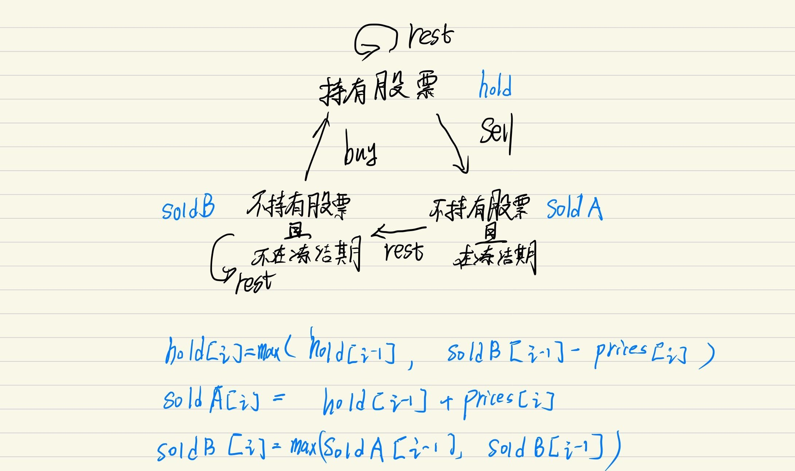

# 题目
给定一个整数数组，其中第 i 个元素代表了第 i 天的股票价格 。​
设计一个算法计算出最大利润。在满足以下约束条件下，你可以尽可能地完成更多的交易（多次买卖一支股票）:
你不能同时参与多笔交易（你必须在再次购买前出售掉之前的股票）。
卖出股票后，你无法在第二天买入股票 (即冷冻期为 1 天)。
>示例:
输入: [1,2,3,0,2]  
输出: 3   
解释: 对应的交易状态为: [买入, 卖出, 冷冻期, 买入, 卖出]  

# 动态规划
首先通关画状态机来穷举所有可能的状态以及如何相互转换

接着考虑起始情况
```cpp
hold[-1] = INT_MIN;//没开始交易的时候有股票 不可能
soldB[-1] = 0;//没开始的时候无股票 收益0
soldA[-1] = INT_MIN;//没开始的时候就交易过 不可能
```
最后考虑结果，最终最高收益只有可能是不持有股票，即max(soldA[n-1],soldB[n-1])

为了表示下标-1，我将数组整体后移一位。
```cpp
class Solution {
public:
    int maxProfit(vector<int>& prices) {
        int n = prices.size();
        int hold[n+1],soldA[n+1],soldB[n+1];
        fill(hold,hold+n+1,0);
        fill(soldA,soldA+n+1,0);
        fill(soldB,soldB+n+1,0);
        hold[0] = INT_MIN;
        soldB[0] = 0;
        soldA[0] = INT_MIN;
        for(int i = 1; i <= n;++i)
        {
            hold[i] = max(hold[i-1],soldB[i-1]-prices[i-1]);
            soldA[i] = hold[i-1]+prices[i-1];
            soldB[i] = max(soldA[i-1],soldB[i-1]);
        }
        return max(soldA[n],soldB[n]);
    }
};
```